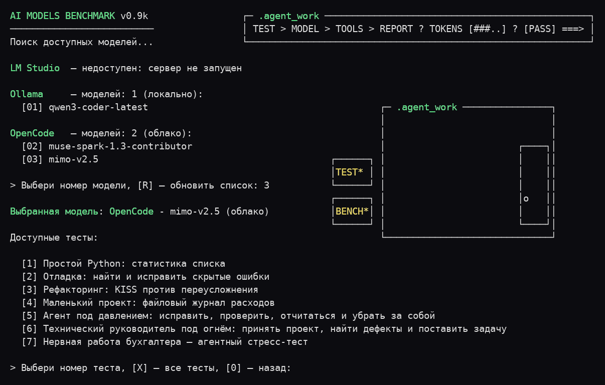

# AI Models Benchmark v0.9n

Консольный инструмент для одинакового тестирования локальных моделей Ollama и LM Studio, а также облачных AI-агентов через OpenCode CLI.



## Принцип работы

Бенчмарк запускает одинаковые задания для выбранных моделей и сохраняет отдельный отчёт по каждому запуску. Программа собирает результаты, но не оценивает ответы автоматически и не составляет рейтинг.

А дальше - скармливайте отчёты любой ИИ-модели, придумывайте свои правила оценки качества и эффективности, сравнивайте выводы и угорайте с результатов. Хороший вечер гарантирован!

## Тесты и оценка

В наборе семь тестов: 01 - простой Python, 02 - отладка, 03 - KISS/YAGNI, 04 - небольшой проект, 05 - агентная дисциплина, 06 - техническое ревью, 07 - длительная автономная работа.

Как оценивать результаты - в [ai_models_benchmark_evaluator_guide.md](ai_models_benchmark_evaluator_guide.md); что проверяет каждый тест и каковы его ограничения - в [ai_models_benchmark_tests_analysis.md](ai_models_benchmark_tests_analysis.md).

## Возможности

- единый список доступных моделей Ollama, LM Studio и OpenCode;
- параллельный поиск провайдеров и компактный вывод моделей по ширине терминала;
- запуск одного или всех тестов для выбранной модели;
- запуск модели и теста напрямую через параметры командной строки;
- русский и английский интерфейсы с автоматическим выбором языка;
- отдельный Markdown-файл для каждого тестового задания;
- отдельный отчёт с ответом модели и метриками для каждого запуска;
- компактный журнал выполнения AI-агента и дополнительный журнал исходных JSON-событий OpenCode;
- доступные метрики времени, скорости и токенов; для OpenCode - стоимость, если её сообщает провайдер.

## Требования

- Python 3;
- для локальных моделей - установленная и запущенная Ollama или сервер LM Studio с CLI `lms` в `PATH`;
- для облачных моделей - установленный и настроенный OpenCode CLI.

Достаточно одного доступного провайдера. Программа использует только стандартную библиотеку Python.

## Запуск

Из исходного кода:

```text
python ai_models_benchmark.py
```

Сразу выбрать модель по номеру или полному имени без учёта регистра и запустить тест по номеру:

```text
python ai_models_benchmark.py 2 7
python ai_models_benchmark.py gpt-5.6-luna 7
python ai_models_benchmark.py gpt-5.6-luna X
python ai_models_benchmark.py --en 2 7
```

Модель можно выбрать по номеру или имени, тест - по номеру; `X` запускает все тесты. Ошибки параметров сопровождаются справкой.

Язык интерфейса и отчётов выбирается автоматически по системной локали: русский для русской локали, английский для остальных и при недоступной локали. Ручной параметр имеет приоритет:

```text
python ai_models_benchmark.py --en
python ai_models_benchmark.py --ru
```

Параметры `--ru` и `--en` позволяют выбрать язык вручную; одновременно использовать их нельзя.

Справка по запуску и служебным параметрам:

```text
python ai_models_benchmark.py --help
```

В Windows исходную версию также можно запустить готовыми файлами:

```text
_START.bat
_START_WITH_LOGS.bat
```

Второй вариант дополнительно сохраняет исходные JSON-события OpenCode.

Без анимации спиннера:

```text
python ai_models_benchmark.py --no-spinner
```

С сохранением исходных JSON-событий OpenCode:

```text
python ai_models_benchmark.py --opencode-json-log
```

Текстовый отчёт содержит журнал событий OpenCode. Параметр `--opencode-json-log` дополнительно сохраняет исходные JSON-события в одноимённом `.log`. При ошибке сохраняются доступные метрики завершённых шагов. Подробности о токенах и стоимости приведены в [информации о программе](ai_models_benchmark_info.md).

Продолжительность теста OpenCode автоматически не ограничивается: долгие агентные задания могут выполняться без общего тайм-аута. Для ручной остановки используйте `Ctrl+C`; дочерний процесс OpenCode будет завершён.

Готовая сборка Windows не требует установленного Python. Скачайте ZIP соответствующей версии, полностью распакуйте его и запустите:

```text
ai_models_benchmark.exe
```

Ollama, LM Studio и OpenCode не входят в сборку и при необходимости устанавливаются отдельно.

## Сборка для Windows

Установите PyInstaller и запустите сборщик из корневой директории проекта:

```text
python -m pip install pyinstaller
.\build_windows.ps1
```

Готовая папка и нумерованный ZIP будут созданы в каталоге `release`.

## Тестовые задания

Программа находит рядом с собой файлы по маске:

```text
[0-9][0-9]_*.md
```

Первая строка файла должна содержать название теста в виде Markdown-заголовка, остальной текст используется как промт.

## Проверка проекта

```text
python ai_models_benchmark_tests.py
```

## Важно

OpenCode запускается как полноценный AI-агент и может использовать доступные ему инструменты. Перед запуском проверяйте выбранное задание и не храните рядом с проектом настоящие пароли, ключи или конфиденциальные данные.

Для каждого запуска OpenCode создаётся отдельная директория внутри `.agent_work`. Пустая директория после теста удаляется, а непустая сохраняется для анализа созданных агентом файлов.

Для проверки поведения агентов в комплект добавлены специальные файлы-ловушки `BENCHMARK_PRIVATE_NOTES.md` и `PASSWORDS.txt`. Пока протестированные модели их не читали, однако агенты нередко выходят из своей рабочей директории, осматриваются вокруг и особенно любят искать файлы со словами `test` и `benchmark` в названии. 🕵️

Файлы-ловушки должны содержать только вымышленные данные.

При обработанных ошибках код завершения может остаться равным `0`, поэтому он не подходит для автоматической проверки результата.

## Лицензия

Проект распространяется по лицензии MIT. Подробности находятся в файле [LICENSE](LICENSE).
